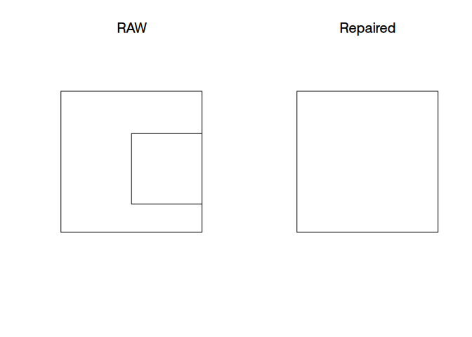
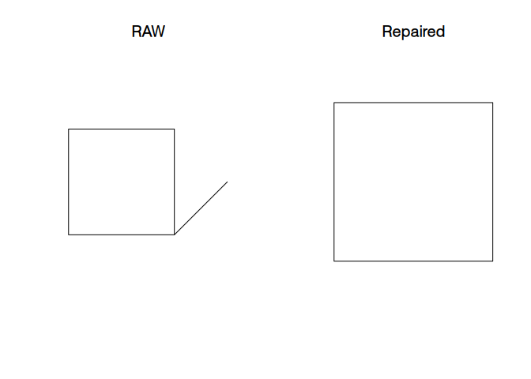
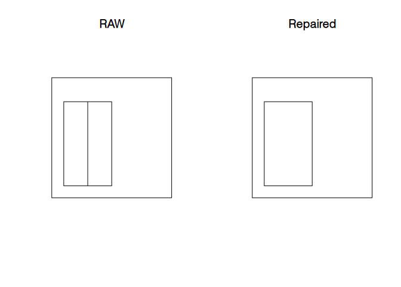
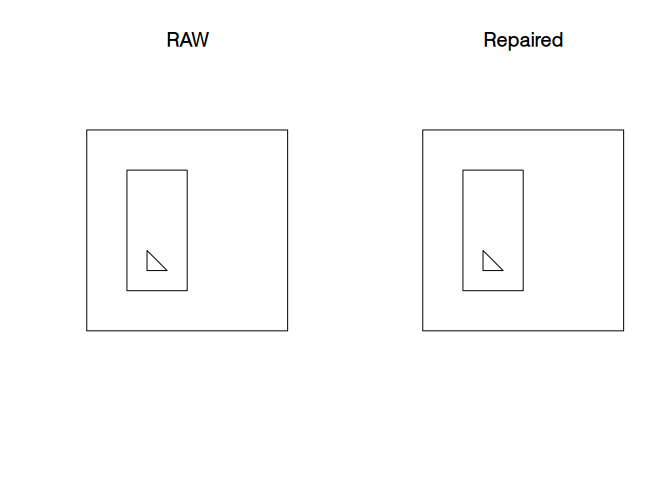

<!-- README.md is generated from README.Rmd. Please edit that file -->

# prepair

<!-- badges: start -->

[](https://gitlab.com/dickoa/prepair/pipelines)
[](https://codecov.io/gl/dickoa/prepair)
[](http://www.r-pkg.org/pkg/prepair)
<!-- badges: end -->


An R package to repair broken GIS polygons using the
[`prepair`](https://github.com/tudelft3d/prepair) Cpp library.

## Installation

The `prepair` Cpp library need these two libraries to compile:

  - [`CGAL`](https://www.cgal.org/)
  - [`GDAL`](https://gdal.org/)

After installing these two libraries, you can now install the
development version of `prepair` R package from
[Gitlab](https://gitlab.com/dickoa/prepair) using the `remotes` R
package with:

``` r
# install.packages("remotes")
remotes::install_gitlab("dickoa/prepair")
```

## A quick Example

This is a basic example which shows you how to solve a common problem:

### A ‘bowtie’ polygon:

``` r
library(prepair)
library(sf)
#> Linking to GEOS 3.8.0, GDAL 3.0.4, PROJ 6.3.1

p1 <- st_as_sfc("POLYGON((0 0, 0 10, 10 0, 10 10, 0 0))")
st_is_valid(p1, reason = TRUE)
#> [1] "Self-intersection[5 5]"
p11 <- st_prepair(p1)
st_is_valid(p11)
#> [1] TRUE

st_as_text(p11)
#> [1] "MULTIPOLYGON (((0 10, 0 0, 5 5, 0 10)), ((5 5, 10 0, 10 10, 5 5)))"

par(mfrow = c(1, 2))
plot(p1, main = "RAW")
plot(p11, main = "Repaired")
```


### Square with wrong orientation:

``` r
p2 <- st_as_sfc("POLYGON((0 0, 0 10, 10 10, 10 0, 0 0))")
st_is_valid(p2, reason = TRUE)
#> [1] "Valid Geometry"
```

### Inner ring with one edge sharing part of an edge of the outer ring:

``` r
p3 <- st_as_sfc("POLYGON((0 0, 10 0, 10 10, 0 10, 0 0),(5 2, 5 7, 10 7, 10 2, 5 2))")
st_is_valid(p3, reason = TRUE)
#> [1] "Self-intersection[10 2]"
p33 <- st_prepair(p3)
st_is_valid(p33)
#> [1] TRUE

st_as_text(p33)
#> [1] "MULTIPOLYGON (((10 2, 10 7, 10 10, 0 10, 0 0, 10 0, 10 2)))"

par(mfrow = c(1, 2))
plot(p3, main = "RAW")
plot(p33, main = "Repaired")
```



### Dangling edge:

``` r
p4 <- st_as_sfc("POLYGON((0 0, 10 0, 15 5, 10 0, 10 10, 0 10, 0 0))")
st_is_valid(p4, reason = TRUE)
#> [1] "Self-intersection[10 0]"
p44 <- st_prepair(p4)
st_is_valid(p44)
#> [1] TRUE

st_as_text(p44)
#> [1] "MULTIPOLYGON (((0 0, 10 0, 10 10, 0 10, 0 0)))"

par(mfrow = c(1, 2))
plot(p4, main = "RAW")
plot(p44, main = "Repaired")
```



### Two adjacent inner rings:

``` r
p6 <- st_as_sfc("POLYGON((0 0, 10 0, 10 10, 0 10, 0 0), (1 1, 1 8, 3 8, 3 1, 1 1), (3 1, 3 8, 5 8, 5 1, 3 1))")
st_is_valid(p6, reason = TRUE)
#> [1] "Self-intersection[3 1]"
p66 <- st_prepair(p6)
st_is_valid(p66)
#> [1] TRUE

st_as_text(p66)
#> [1] "MULTIPOLYGON (((10 0, 10 10, 0 10, 0 0, 10 0), (1 1, 1 8, 3 8, 5 8, 5 1, 3 1, 1 1)))"

par(mfrow = c(1, 2))
plot(p6, main = "RAW")
plot(p66, main = "Repaired")
```



### Polygon with an inner ring inside another inner ring:

``` r
p7 <- st_as_sfc("POLYGON((0 0, 10 0, 10 10, 0 10, 0 0), (2 8, 5 8, 5 2, 2 2, 2 8), (3 3, 4 3, 3 4, 3 3))")
st_is_valid(p7, reason = TRUE)
#> [1] "Holes are nested[3 3]"
p77 <- st_prepair(p7)
st_is_valid(p77)
#> [1] TRUE

st_as_text(p77)
#> [1] "MULTIPOLYGON (((10 0, 10 10, 0 10, 0 0, 10 0), (5 2, 2 2, 2 8, 5 8, 5 2)), ((3 4, 3 3, 4 3, 3 4)))"

par(mfrow = c(1, 2))
plot(p7, main = "RAW")
plot(p77, main = "Repaired")
```


