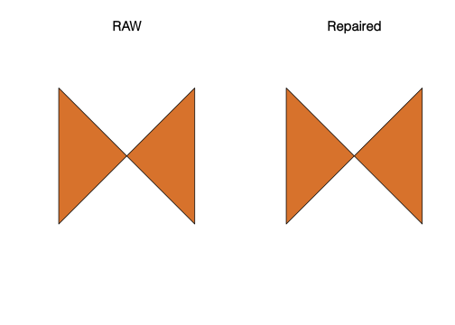

<!-- README.md is generated from README.Rmd. Please edit that file -->

# prepair 

<!-- badges: start -->

[](https://gitlab.com/dickoa/prepair/pipelines)
[](https://codecov.io/gl/dickoa/prepair)
[](http://www.r-pkg.org/pkg/prepair)
<!-- badges: end -->

An R package to repair broken GIS polygons using the
[`prepair`](https://github.com/tudelft3d/prepair) Cpp library.

## Installation

The `prepair` Cpp library need these two libraries to compile:

  - [`CGAL`](https://www.cgal.org/)
  - [`GDAL`](https://gdal.org/)

The R package `prepair` solves the CGAL dependencies by using the
[`cgal4headers`](https://gitlab.com/dickoa/cgal4headers) that expose
CGAL 4 headers. We use [`rwinlib`](https://github.com/rwinlib) to
provide `GDAL` on Windows in order to build this package from source.

`prepair` can also use these optional libraries:

  - [`GMP`](https://gmplib.org/)
  - [`MPFR`](https://www.mpfr.org/)

They are disabled by default on Windows but required if you want to
build the package in a Linux/OS X environment. After installing all
these libraries, you can now install the development version of the
`prepair` R package from [Gitlab](https://gitlab.com/dickoa/prepair)
using the `remotes` R package with:

``` r
# install.packages("remotes")
remotes::install_gitlab("dickoa/prepair")
```

## A quick tutorial

This is a basic example which shows you how to solve a common problem:

### A ‘bowtie’ polygon:

``` r
library(prepair)
library(sf)

p1 <- st_as_sfc("POLYGON((0 0, 0 10, 10 0, 10 10, 0 0))")
st_is_valid(p1, reason = TRUE)
#> [1] "Self-intersection[5 5]"
p11 <- st_prepair(p1)
st_is_valid(p11)
#> [1] TRUE

st_as_text(p11)
#> [1] "MULTIPOLYGON (((0 10, 0 0, 5 5, 0 10)), ((5 5, 10 0, 10 10, 5 5)))"

par(mfrow = c(1, 2))
plot(p1, main = "RAW")
plot(p11, main = "Repaired")
```



### Square with wrong orientation:

``` r
p2 <- st_as_sfc("POLYGON((0 0, 0 10, 10 10, 10 0, 0 0))")
st_is_valid(p2, reason = TRUE)
#> [1] "Valid Geometry"
```

### Inner ring with one edge sharing part of an edge of the outer ring:

``` r
p3 <- st_as_sfc("POLYGON((0 0, 10 0, 10 10, 0 10, 0 0),(5 2, 5 7, 10 7, 10 2, 5 2))")
st_is_valid(p3, reason = TRUE)
#> [1] "Self-intersection[10 2]"
p33 <- st_prepair(p3)
st_is_valid(p33)
#> [1] TRUE

st_as_text(p33)
#> [1] "MULTIPOLYGON (((10 2, 10 7, 10 10, 0 10, 0 0, 10 0, 10 2)))"

par(mfrow = c(1, 2))
plot(p3, main = "RAW")
plot(p33, main = "Repaired")
```


### Dangling edge:

``` r
p4 <- st_as_sfc("POLYGON((0 0, 10 0, 15 5, 10 0, 10 10, 0 10, 0 0))")
st_is_valid(p4, reason = TRUE)
#> [1] "Self-intersection[10 0]"
p44 <- st_prepair(p4)
st_is_valid(p44)
#> [1] TRUE

st_as_text(p44)
#> [1] "MULTIPOLYGON (((0 0, 10 0, 10 10, 0 10, 0 0)))"

par(mfrow = c(1, 2))
plot(p4, main = "RAW")
plot(p44, main = "Repaired")
```


### Two adjacent inner rings:

``` r
p6 <- st_as_sfc("POLYGON((0 0, 10 0, 10 10, 0 10, 0 0), (1 1, 1 8, 3 8, 3 1, 1 1), (3 1, 3 8, 5 8, 5 1, 3 1))")
st_is_valid(p6, reason = TRUE)
#> [1] "Self-intersection[3 1]"
p66 <- st_prepair(p6)
st_is_valid(p66)
#> [1] TRUE

st_as_text(p66)
#> [1] "MULTIPOLYGON (((10 0, 10 10, 0 10, 0 0, 10 0), (1 1, 1 8, 3 8, 5 8, 5 1, 3 1, 1 1)))"

par(mfrow = c(1, 2))
plot(p6, main = "RAW")
plot(p66, main = "Repaired")
```


### Polygon with an inner ring inside another inner ring:

``` r
p7 <- st_as_sfc("POLYGON((0 0, 10 0, 10 10, 0 10, 0 0), (2 8, 5 8, 5 2, 2 2, 2 8), (3 3, 4 3, 3 4, 3 3))")
st_is_valid(p7, reason = TRUE)
#> [1] "Holes are nested[3 3]"
p77 <- st_prepair(p7)
st_is_valid(p77)
#> [1] TRUE

st_as_text(p77)
#> [1] "MULTIPOLYGON (((10 0, 10 10, 0 10, 0 0, 10 0), (5 2, 2 2, 2 8, 5 8, 5 2)), ((3 4, 3 3, 4 3, 3 4)))"

par(mfrow = c(1, 2))
plot(p7, main = "RAW")
plot(p77, main = "Repaired")
```


## A exemple with a real dataset

### Reading the data

``` r
(clc1 <- read_sf("https://github.com/tudelft3d/prepair/raw/master/data/CLC2006_180927.geojson"))
#> Simple feature collection with 1 feature and 0 fields
#> geometry type:  POLYGON
#> dimension:      XY
#> bbox:           xmin: 17.25904 ymin: 67.98536 xmax: 21.11988 ymax: 69.54275
#> geographic CRS: WGS 84
#> # A tibble: 1 x 1
#>                                                          geometry
#>                                                     <POLYGON [°]>
#> 1 ((20.33495 69.31206, 20.32738 69.31229, 20.32749 69.31274, 20.…
(clc2 <- read_sf("https://github.com/tudelft3d/prepair/raw/master/data/CLC2006_2018418.geojson"))
#> Simple feature collection with 1 feature and 0 fields
#> geometry type:  POLYGON
#> dimension:      XY
#> bbox:           xmin: 22.2989 ymin: 41.44139 xmax: 22.96658 ymax: 41.86164
#> geographic CRS: WGS 84
#> # A tibble: 1 x 1
#>                                                          geometry
#>                                                     <POLYGON [°]>
#> 1 ((22.71665 41.73939, 22.71759 41.73931, 22.71858 41.73926, 22.…
par(mfrow = c(1, 2))
plot(st_geometry(clc1), main = "CLC2006_180927", col = 'lightblue', axes = TRUE, graticule = TRUE, lwd = 0.2, cex.axis = 0.5)
plot(st_geometry(clc2), main = "CLC2006_2018418", col = "lightblue", axes = TRUE, graticule = TRUE, lwd = 0.2, cex.axis = 0.5)
```


### Check if it’s valid and repair it

``` r
st_is_valid(clc1, reason = TRUE)
#> [1] "Ring Self-intersection[20.1372785154605 68.32204464423]"
(clc1_rpr <- st_prepair(clc1))
#> Simple feature collection with 1 feature and 0 fields
#> geometry type:  MULTIPOLYGON
#> dimension:      XY
#> bbox:           xmin: 17.25904 ymin: 67.98536 xmax: 21.11988 ymax: 69.54275
#> geographic CRS: WGS 84
#> # A tibble: 1 x 1
#>                                                          geometry
#>                                                <MULTIPOLYGON [°]>
#> 1 (((20.33495 69.31206, 20.33491 69.31319, 20.33508 69.31385, 20…
st_is_valid(clc1_rpr)
#> [1] TRUE

st_is_valid(clc2, reason = TRUE)
#> [1] "Ring Self-intersection[22.7166526165073 41.7393917772103]"
(clc2_rpr <- st_prepair(clc2))
#> Simple feature collection with 1 feature and 0 fields
#> geometry type:  MULTIPOLYGON
#> dimension:      XY
#> bbox:           xmin: 22.2989 ymin: 41.44139 xmax: 22.96658 ymax: 41.86164
#> geographic CRS: WGS 84
#> # A tibble: 1 x 1
#>                                                          geometry
#>                                                <MULTIPOLYGON [°]>
#> 1 (((22.71665 41.73939, 22.71663 41.73884, 22.71634 41.73816, 22…
st_is_valid(clc2_rpr)
#> [1] TRUE
```

### How fast is `st_prepair` ?

`prepair::st_prepair` is fast and can be in some cases faster than
`sf::st_make_valid`

``` r
(bnch1 <- bench::mark(st_make_valid(clc1), st_prepair(clc1), check = FALSE))
#> # A tibble: 2 x 6
#>   expression               min   median `itr/sec` mem_alloc
#>   <bch:expr>          <bch:tm> <bch:tm>     <dbl> <bch:byt>
#> 1 st_make_valid(clc1)    2.19s    2.19s     0.456        NA
#> 2 st_prepair(clc1)    459.44ms 463.18ms     2.16         NA
#> # … with 1 more variable: `gc/sec` <dbl>
summary(bnch1, relative = TRUE)
#> # A tibble: 2 x 6
#>   expression            min median `itr/sec` mem_alloc `gc/sec`
#>   <bch:expr>          <dbl>  <dbl>     <dbl>     <dbl>    <dbl>
#> 1 st_make_valid(clc1)  4.77   4.73      1           NA      NaN
#> 2 st_prepair(clc1)     1      1         4.73        NA      NaN

(bnch2 <- bench::mark(st_make_valid(clc2), st_prepair(clc2), check = FALSE))
#> # A tibble: 2 x 6
#>   expression              min median `itr/sec` mem_alloc `gc/sec`
#>   <bch:expr>          <bch:t> <bch:>     <dbl> <bch:byt>    <dbl>
#> 1 st_make_valid(clc2)   747ms  747ms      1.34        NA        0
#> 2 st_prepair(clc2)      180ms  182ms      5.51        NA        0
summary(bnch2, relative = TRUE)
#> # A tibble: 2 x 6
#>   expression            min median `itr/sec` mem_alloc `gc/sec`
#>   <bch:expr>          <dbl>  <dbl>     <dbl>     <dbl>    <dbl>
#> 1 st_make_valid(clc2)  4.15   4.11      1           NA      NaN
#> 2 st_prepair(clc2)     1      1         4.12        NA      NaN
```

You also have cases where it’s slower to `sf::st_make_valid`, let’s use
this data from a [closed
issue](https://github.com/r-spatial/sf/issues/1280) in the `sf` R
package.

``` r
## need vsicurl
(agb <- read_sf("/vsicurl/http://files.hawaii.gov/dbedt/op/gis/data/2015AgBaseline.shp.zip"))
#> Simple feature collection with 5024 features and 6 fields
#> geometry type:  MULTIPOLYGON
#> dimension:      XY
#> bbox:           xmin: 419564.3 ymin: 2095890 xmax: 938457.6 ymax: 2457686
#> projected CRS:  NAD83 / UTM zone 4N
#> # A tibble: 5,024 x 7
#>    OBJECTID CropCatego Island Acrage Shape_Leng Shape_Area
#>       <dbl> <chr>      <chr>   <dbl>      <dbl>      <dbl>
#>  1     4529 Commercia… Kauai  2.73e2      6301.   1104891.
#>  2     4530 Coffee     Kauai  7.44e0      1254.     30103.
#>  3     4531 Coffee     Kauai  4.65e0       772.     18813.
#>  4     4532 Coffee     Kauai  1.13e3     16248.   4572534.
#>  5     4533 Coffee     Kauai  3.49e0       858.     14106.
#>  6     4534 Coffee     Kauai  5.21e2      7868.   2106938.
#>  7     4535 Coffee     Kauai  7.16e2     11290.   2896255.
#>  8     4536 Coffee     Kauai  1.33e2      3705.    539524.
#>  9     4537 Flowers /… Kauai  3.52e1      1871.    142623.
#> 10     4538 Coffee     Kauai  9.69e1      2930.    391962.
#> # … with 5,014 more rows, and 1 more variable:
#> #   geometry <MULTIPOLYGON [m]>
all(st_is_valid(agb))
#> [1] FALSE
all(st_is_valid(st_make_valid(agb)))
#> [1] TRUE
all(st_is_valid(st_prepair(agb)))
#> [1] TRUE

plot(st_geometry(agb), main = "2015 Agriculture baseline", col = 'lightblue', axes = TRUE, graticule = TRUE, lwd = 0.2, cex.axis = 0.5)
```


`sf::st_make_valid` is faster with this data.

``` r
(bnch3 <- bench::mark(st_make_valid(agb), st_prepair(agb), check = FALSE))
#> Warning: Some expressions had a GC in every iteration; so
#> filtering is disabled.
#> # A tibble: 2 x 6
#>   expression             min  median `itr/sec` mem_alloc `gc/sec`
#>   <bch:expr>         <bch:t> <bch:t>     <dbl> <bch:byt>    <dbl>
#> 1 st_make_valid(agb)   1.61s   1.61s     0.619        NA    1.24 
#> 2 st_prepair(agb)      3.88s   3.88s     0.258        NA    0.258
summary(bnch3, relative = TRUE)
#> Warning: Some expressions had a GC in every iteration; so
#> filtering is disabled.
#> # A tibble: 2 x 6
#>   expression           min median `itr/sec` mem_alloc `gc/sec`
#>   <bch:expr>         <dbl>  <dbl>     <dbl>     <dbl>    <dbl>
#> 1 st_make_valid(agb)  1      1         2.40        NA     4.81
#> 2 st_prepair(agb)     2.40   2.40      1           NA     1
```
