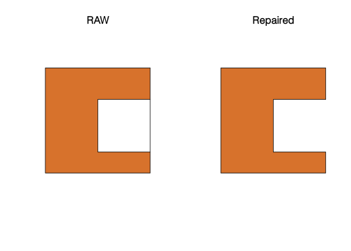
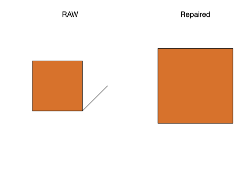

<!-- README.md is generated from README.Rmd. Please edit that file -->

# prepair

<!-- badges: start -->

[](https://gitlab.com/dickoa/prepair/pipelines)
[](https://codecov.io/gl/dickoa/prepair)
[](http://www.r-pkg.org/pkg/prepair)
<!-- badges: end -->


An R package to repair broken GIS polygons using the
[`prepair`](https://github.com/tudelft3d/prepair) Cpp library.

## Installation

The `prepair` Cpp library need these two libraries to compile:

  - [`CGAL`](https://www.cgal.org/)
  - [`GDAL`](https://gdal.org/)

The R package `prepair` solves the CGAL dependencies by using the
[`cgal4headers`](https://gitlab.com/dickoa/cgal4headers) that expose
CGAL 4 headers. We use [`rwinlib`](https://github.com/rwinlib) to
provide `GDAL` on Windows in order to build this package from source.

These two optional libraries are disabled by default in Windows but
required if you want to build the Linux/OS X version of the package.

  - [`GMP`](https://gmplib.org/)
  - [`MPFR`](https://www.mpfr.org/)

After installing all the system requirements, you can now install the
development version of the `prepair` R package from
[Gitlab](https://gitlab.com/dickoa/prepair) using the `remotes` R
package with:

``` r
# install.packages("remotes")
remotes::install_gitlab("dickoa/prepair")
```

## A quick tutorial

This is a basic example which shows you how to solve a common problem:

### A ‘bowtie’ polygon:

``` r
library(prepair)
library(sf)

p1 <- st_as_sfc("POLYGON((0 0, 0 10, 10 0, 10 10, 0 0))")
st_is_valid(p1, reason = TRUE)
#> [1] "Self-intersection[5 5]"
p11 <- st_prepair(p1)
st_is_valid(p11)
#> [1] TRUE

st_as_text(p11)
#> [1] "MULTIPOLYGON (((0 10, 0 0, 5 5, 0 10)), ((5 5, 10 0, 10 10, 5 5)))"

par(mfrow = c(1, 2))
plot(p1, main = "RAW")
plot(p11, main = "Repaired")
```


### Square with wrong orientation:

``` r
p2 <- st_as_sfc("POLYGON((0 0, 0 10, 10 10, 10 0, 0 0))")
st_is_valid(p2, reason = TRUE)
#> [1] "Valid Geometry"
```

### Inner ring with one edge sharing part of an edge of the outer ring:

``` r
p3 <- st_as_sfc("POLYGON((0 0, 10 0, 10 10, 0 10, 0 0),(5 2, 5 7, 10 7, 10 2, 5 2))")
st_is_valid(p3, reason = TRUE)
#> [1] "Self-intersection[10 2]"
p33 <- st_prepair(p3)
st_is_valid(p33)
#> [1] TRUE

st_as_text(p33)
#> [1] "MULTIPOLYGON (((10 2, 10 7, 10 10, 0 10, 0 0, 10 0, 10 2)))"

par(mfrow = c(1, 2))
plot(p3, main = "RAW")
plot(p33, main = "Repaired")
```



### Dangling edge:

``` r
p4 <- st_as_sfc("POLYGON((0 0, 10 0, 15 5, 10 0, 10 10, 0 10, 0 0))")
st_is_valid(p4, reason = TRUE)
#> [1] "Self-intersection[10 0]"
p44 <- st_prepair(p4)
st_is_valid(p44)
#> [1] TRUE

st_as_text(p44)
#> [1] "MULTIPOLYGON (((0 0, 10 0, 10 10, 0 10, 0 0)))"

par(mfrow = c(1, 2))
plot(p4, main = "RAW")
plot(p44, main = "Repaired")
```



### Two adjacent inner rings:

``` r
p6 <- st_as_sfc("POLYGON((0 0, 10 0, 10 10, 0 10, 0 0), (1 1, 1 8, 3 8, 3 1, 1 1), (3 1, 3 8, 5 8, 5 1, 3 1))")
st_is_valid(p6, reason = TRUE)
#> [1] "Self-intersection[3 1]"
p66 <- st_prepair(p6)
st_is_valid(p66)
#> [1] TRUE

st_as_text(p66)
#> [1] "MULTIPOLYGON (((10 0, 10 10, 0 10, 0 0, 10 0), (1 1, 1 8, 3 8, 5 8, 5 1, 3 1, 1 1)))"

par(mfrow = c(1, 2))
plot(p6, main = "RAW")
plot(p66, main = "Repaired")
```


### Polygon with an inner ring inside another inner ring:

``` r
p7 <- st_as_sfc("POLYGON((0 0, 10 0, 10 10, 0 10, 0 0), (2 8, 5 8, 5 2, 2 2, 2 8), (3 3, 4 3, 3 4, 3 3))")
st_is_valid(p7, reason = TRUE)
#> [1] "Holes are nested[3 3]"
p77 <- st_prepair(p7)
st_is_valid(p77)
#> [1] TRUE

st_as_text(p77)
#> [1] "MULTIPOLYGON (((10 0, 10 10, 0 10, 0 0, 10 0), (5 2, 2 2, 2 8, 5 8, 5 2)), ((3 4, 3 3, 4 3, 3 4)))"

par(mfrow = c(1, 2))
plot(p7, main = "RAW")
plot(p77, main = "Repaired")
```


## A exemple with a real dataset

### Reading the data

``` r
(clc1 <- read_sf("https://github.com/tudelft3d/prepair/raw/master/data/CLC2006_180927.geojson"))
#> Simple feature collection with 1 feature and 0 fields
#> geometry type:  POLYGON
#> dimension:      XY
#> bbox:           xmin: 17.25904 ymin: 67.98536 xmax: 21.11988 ymax: 69.54275
#> geographic CRS: WGS 84
#> # A tibble: 1 x 1
#>                                                          geometry
#>                                                     <POLYGON [°]>
#> 1 ((20.33495 69.31206, 20.32738 69.31229, 20.32749 69.31274, 20.…
(clc2 <- read_sf("https://github.com/tudelft3d/prepair/raw/master/data/CLC2006_2018418.geojson"))
#> Simple feature collection with 1 feature and 0 fields
#> geometry type:  POLYGON
#> dimension:      XY
#> bbox:           xmin: 22.2989 ymin: 41.44139 xmax: 22.96658 ymax: 41.86164
#> geographic CRS: WGS 84
#> # A tibble: 1 x 1
#>                                                          geometry
#>                                                     <POLYGON [°]>
#> 1 ((22.71665 41.73939, 22.71759 41.73931, 22.71858 41.73926, 22.…
par(mfrow = c(1, 2))
plot(st_geometry(clc1), main = "CLC2006_180927", col = 'lightblue', axes = TRUE, graticule = TRUE, lwd = 0.2, cex.axis = 0.5)
plot(st_geometry(clc2), main = "CLC2006_2018418", col = "lightblue", axes = TRUE, graticule = TRUE, lwd = 0.2, cex.axis = 0.5)
```


### Check if it’s valid and repair it

``` r
st_is_valid(clc1, reason = TRUE)
#> [1] "Ring Self-intersection[20.1372785154605 68.32204464423]"
(clc1_rpr <- st_prepair(clc1))
#> Simple feature collection with 1 feature and 0 fields
#> geometry type:  MULTIPOLYGON
#> dimension:      XY
#> bbox:           xmin: 17.25904 ymin: 67.98536 xmax: 21.11988 ymax: 69.54275
#> geographic CRS: WGS 84
#> # A tibble: 1 x 1
#>                                                          geometry
#>                                                <MULTIPOLYGON [°]>
#> 1 (((20.33495 69.31206, 20.33491 69.31319, 20.33508 69.31385, 20…
st_is_valid(clc1_rpr)
#> [1] TRUE

st_is_valid(clc2, reason = TRUE)
#> [1] "Ring Self-intersection[22.7166526165073 41.7393917772103]"
(clc2_rpr <- st_prepair(clc2))
#> Simple feature collection with 1 feature and 0 fields
#> geometry type:  MULTIPOLYGON
#> dimension:      XY
#> bbox:           xmin: 22.2989 ymin: 41.44139 xmax: 22.96658 ymax: 41.86164
#> geographic CRS: WGS 84
#> # A tibble: 1 x 1
#>                                                          geometry
#>                                                <MULTIPOLYGON [°]>
#> 1 (((22.71665 41.73939, 22.71663 41.73884, 22.71634 41.73816, 22…
st_is_valid(clc2_rpr)
#> [1] TRUE
```

### How fast is `st_prepair` ?

``` r
(bnch1 <- bench::mark(st_make_valid(clc1), st_prepair(clc1), check = FALSE))
#> # A tibble: 2 x 6
#>   expression               min   median `itr/sec` mem_alloc
#>   <bch:expr>          <bch:tm> <bch:tm>     <dbl> <bch:byt>
#> 1 st_make_valid(clc1)    2.25s    2.25s     0.445        NA
#> 2 st_prepair(clc1)    470.03ms 471.38ms     2.12         NA
#> # … with 1 more variable: `gc/sec` <dbl>
summary(bnch1, relative = TRUE)
#> # A tibble: 2 x 6
#>   expression            min median `itr/sec` mem_alloc `gc/sec`
#>   <bch:expr>          <dbl>  <dbl>     <dbl>     <dbl>    <dbl>
#> 1 st_make_valid(clc1)  4.78   4.77      1           NA      NaN
#> 2 st_prepair(clc1)     1      1         4.77        NA      NaN

(bnch2 <- bench::mark(st_make_valid(clc2), st_prepair(clc2), check = FALSE))
#> # A tibble: 2 x 6
#>   expression              min median `itr/sec` mem_alloc `gc/sec`
#>   <bch:expr>          <bch:t> <bch:>     <dbl> <bch:byt>    <dbl>
#> 1 st_make_valid(clc2)   747ms  747ms      1.34        NA     0   
#> 2 st_prepair(clc2)      187ms  187ms      5.34        NA     2.67
summary(bnch2, relative = TRUE)
#> # A tibble: 2 x 6
#>   expression            min median `itr/sec` mem_alloc `gc/sec`
#>   <bch:expr>          <dbl>  <dbl>     <dbl>     <dbl>    <dbl>
#> 1 st_make_valid(clc2)  4.00   3.99      1           NA      NaN
#> 2 st_prepair(clc2)     1      1         3.99        NA      Inf
```
